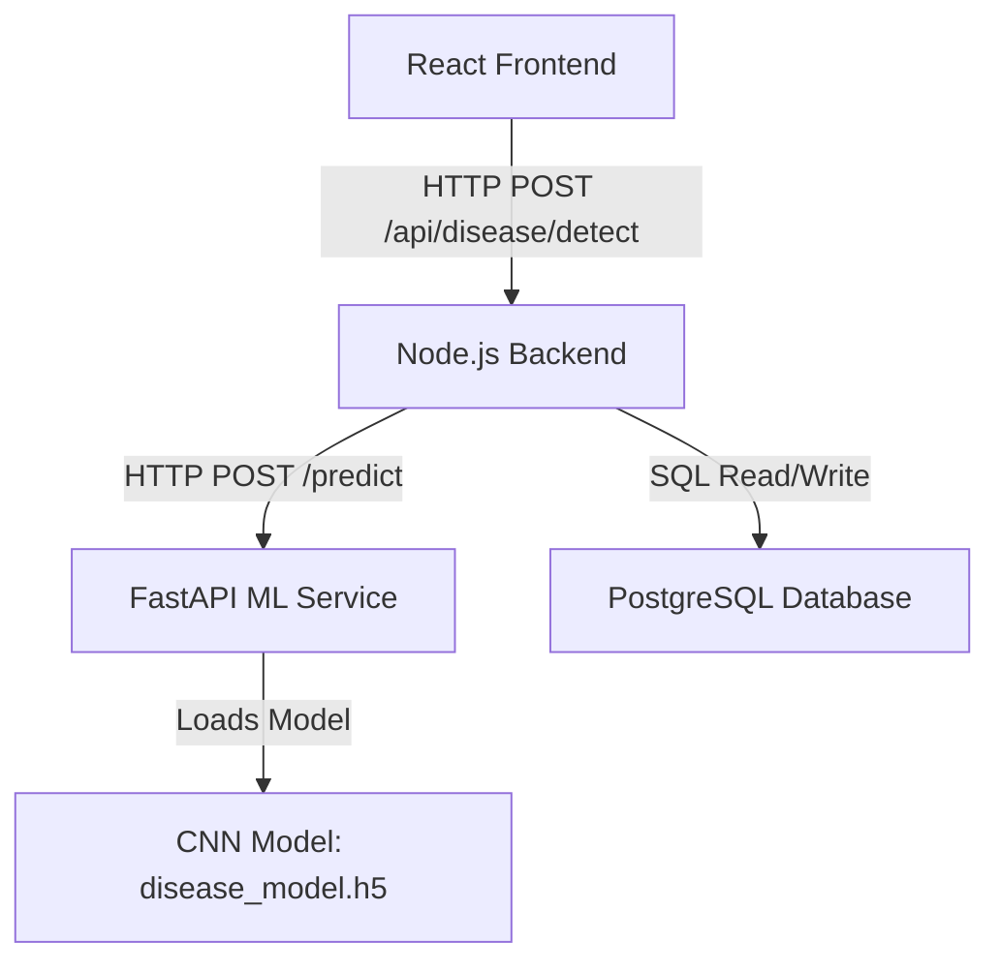
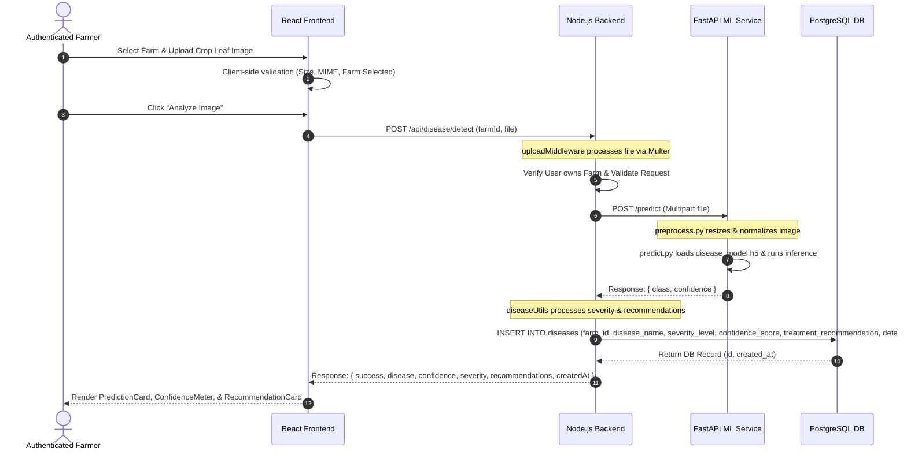

# Disease Detection Module Architecture

This document freezes the technical design and system architecture for the Disease Detection module.

## 1. High-Level Component Architecture
The module is divided into three key service layers:



- **Frontend (React)**: Handles user interaction, image selection/validation, upload triggering, and rendering analysis results and farm-specific histories.
- **Backend (Node.js)**: Performs request validation, auth verification, file upload filtering (Multer), forwards request payload to the ML service, processes output, stores records in DB, and returns standardized payloads.
- **ML Service (FastAPI)**: Independent microservice that receives raw images, preprocesses them to tensor shape, runs inference, and returns predicted class and confidence.

---

## 2. End-to-End Data Flow



---

## 3. Database Integration Design
Predictions are persisted to the PostgreSQL `diseases` table as defined in the schema `database/schemas/disease.sql`.

### Table Schema (`diseases`)
| Column Name | Data Type | Constraint | Description |
| :--- | :--- | :--- | :--- |
| `id` | SERIAL | PRIMARY KEY | Unique identifier for prediction record |
| `farm_id` | INTEGER | REFERENCES farms(id) ON DELETE CASCADE | Associated farm identification |
| `disease_name` | VARCHAR(255) | NOT NULL | Predicted disease name |
| `severity_level` | VARCHAR(50) | - | Derived severity: Low, Medium, High |
| `confidence_score`| FLOAT | - | Confidence score normalized from ML service |
| `image_url` | VARCHAR(500) | - | Optional URL of the image (V1: null/local file ref) |
| `description` | TEXT | - | Optional description details |
| `treatment_recommendation` | TEXT | - | Derived treatment & precautions |
| `detected_date` | TIMESTAMP | - | Date/time prediction was performed |
| `created_at` | TIMESTAMP | DEFAULT CURRENT_TIMESTAMP | Database insert timestamp |

### Database Query Paths
1. **Create Disease Record**:
   ```sql
   INSERT INTO diseases (farm_id, disease_name, severity_level, confidence_score, treatment_recommendation, detected_date, created_at)
   VALUES ($1, $2, $3, $4, $5, NOW(), NOW())
   RETURNING id, farm_id, disease_name, severity_level, confidence_score, treatment_recommendation, detected_date, created_at;
   ```
2. **Fetch Farm History**:
   ```sql
   SELECT id, disease_name, severity_level, confidence_score, treatment_recommendation, detected_date, created_at
   FROM diseases
   WHERE farm_id = $1
   ORDER BY detected_date DESC;
   ```

---

## 4. Image Upload Strategy
1. **Upload Location**: Standard file streams uploaded through HTTP multipart request form.
2. **Multer Configuration**:
   - Storage: Disk storage inside `ml-service/uploads` (for FastAPI consumption) or memory buffer in Node.js, depending on service location.
   - Node.js backend uses memory storage to buffer the uploaded file and forward it directly as a multipart stream to FastAPI. This eliminates the need for permanent storage or persistent disk file leaks on the backend server in V1.
3. **MIME-Type Validation**: `image/jpeg`, `image/jpg`, `image/png`.
4. **Size Validation**: Cap maximum file size at `10MB`.

---

## 5. Frontend State Architecture
All disease detection actions and state variables are isolated inside the custom React hook `useDiseaseDetection.js` to separate presentation components from logic:

```
[State Variables inside hook]
├── image (File/URL)         --> Holds the preview and active crop image file object
├── loading (Boolean)        --> Toggled true during API requests to show LoadingOverlay
├── prediction (Object)      --> Stores the active classification result
├── error (String/Object)    --> Holds active error details for ErrorMessage display
└── history (Array)          --> Maintains history list of past scans for the farm
```

### Component Topology
- **DiseaseDetection.jsx (Page)**: Grid container linking custom hook to child components:
  - **ImageUploader**: Renders interactive drag-and-drop region.
  - **ImagePreview**: Shows current image with a clear/replace handler.
  - **PredictionCard**: Displays classification results (name, confidence, severity).
  - **ConfidenceMeter**: progress-bar indicating probability.
  - **RecommendationCard**: Displays treatment, medicine, prevention details.
  - **DiseaseHistory**: Chronological list of historical predictions.
  - **LoadingOverlay**: Spinner displayed when `loading === true`.
  - **ErrorMessage**: Standard alert box shown when `error` is present.
