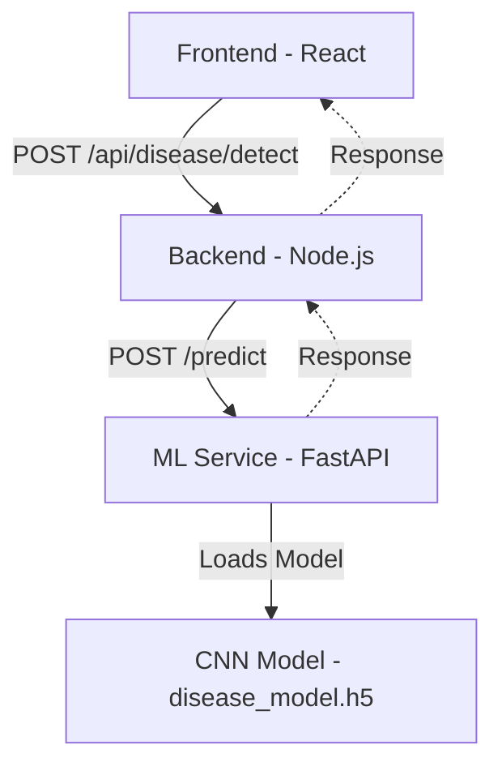

# Disease Detection Architecture

## Description
1. **Frontend**: Image selection, preview, custom hook `useDiseaseDetection` to coordinate API requests, separate components for rendering.
2. **Backend**: Express router and controller, upload middleware for image validation, and ML client service communicating with the FastAPI instance.
3. **ML Service**: FastAPI application utilizing TensorFlow/Keras to load `disease_model.h5`, preprocessing the incoming image, predicting classes, and mapping to severity levels and recommendations.
